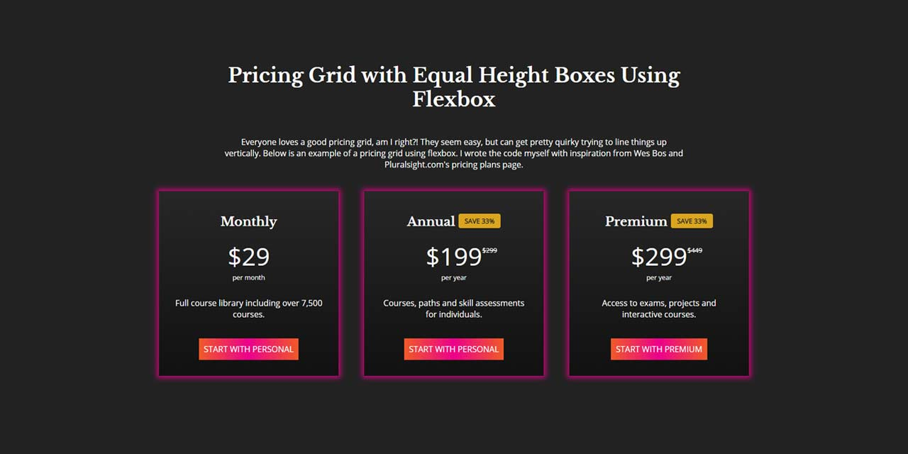

# Pricing Grid with Equal Height Boxes Using Flexbox

An example of a pricing grid with equal height cards and buttons that align at the bottom of the cards.

Thanks to Wes Bos for the tutorials! 

[View the page here](https://kfairris.github.io/pricing-grid/)

### Heading

# H1
## H2
### H3

### Bold

**bold text**

### Italic

*italicized text*

### Blockquote

> blockquote

### Ordered List

1. First item
2. Second item
3. Third item

### Unordered List

- First item
- Second item
- Third item

### Code

`code`

### Horizontal Rule

---

### Link

[title](https://www.example.com)

### Image

